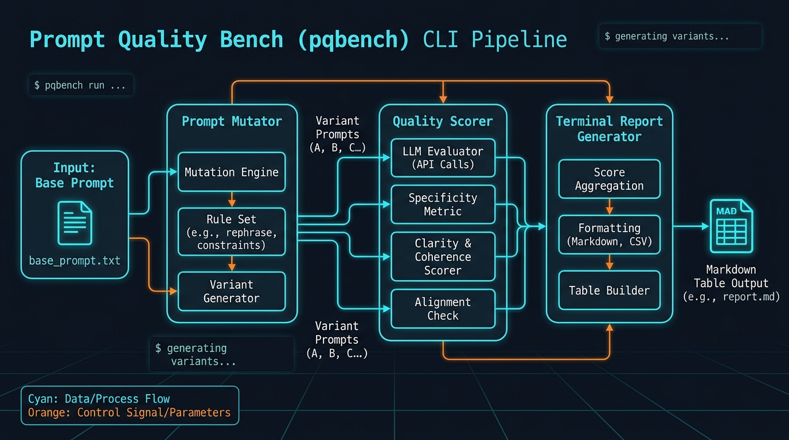
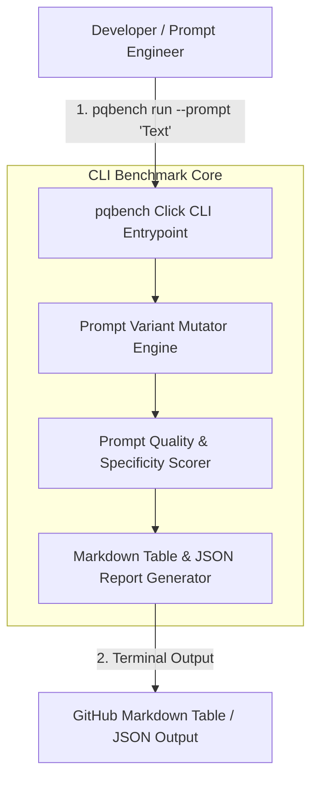

<div align="center">


# prompt-quality-bench

### Enterprise Prompt Engineering Benchmark & Quality Assessment CLI Tool (`pqbench`)

[](https://pypi.org/)
[](https://devopstrio.co.uk)
[](https://python.org)

</div>

---

## ⚡ CLI Quickstart (`pqbench`)

Install `pqbench` locally and run benchmark evaluations directly from your terminal:

```bash
# Install CLI executable
pip install -e .

# Run prompt quality benchmark (Terminal Markdown Table output)
pqbench run --prompt "Summarize microservices architecture best practices."
```

### Sample CLI Terminal Output

```
--- Prompt Quality Benchmark Results ---

| Variant            |   Word Count |   Specificity |   Clarity | Quality Grade   |
|--------------------|--------------|---------------|-----------|-----------------|
| baseline           |            6 |          0    |       0.6 | B               |
| chain_of_thought   |           13 |          0.25 |       0.9 | B               |
| role_persona       |           13 |          0.25 |       0.9 | B               |
| json_format_guard  |           14 |          0.5  |       0.9 | A+              |
```

---

## 🏛️ System Architecture & CLI Pipeline

`pqbench` automates prompt mutation generation (Chain-of-Thought, System Persona, JSON Guardrails) and computes specificity, structural clarity, and token efficiency metrics.





---

## 🛠️ CLI Options & Arguments

```bash
Usage: pqbench run [OPTIONS]

Options:
  -p, --prompt TEXT            Base prompt text to benchmark. [required]
  -f, --format [table|json]    Output report format. [default: table]
  --help                       Show this message and exit.
```

---

## 📂 Repository Directory Layout

```
prompt-quality-bench/
├── .github/
│   └── workflows/
│       └── run-benchmarks.yml   # Automated benchmark workflow
├── docs/
│   ├── ARCHITECTURE.md          # Architectural specification
│   ├── deployment-guide.md      # CLI usage & deployment guide
│   └── images/
│       └── architecture_diagram.jpg # CLI pipeline visual
├── pqbench/
│   ├── __init__.py
│   ├── cli/
│   │   └── main.py              # Click CLI entrypoint (`pqbench run`)
│   ├── mutators/
│   │   └── prompt_mutator.py    # Mutation variant generator
│   ├── metrics/
│   │   └── quality_scorer.py    # Specificity & quality scorer
│   └── reporting/
│       └── report_generator.py  # Markdown table & JSON reporter
├── benchmarks/
│   ├── sample_prompts.json      # Sample prompt dataset
│   └── run_benchmark_suite.py   # Suite runner script
├── tests/
│   ├── test_cli.py              # CLI integration tests
│   ├── test_mutator.py          # Mutator unit tests
│   └── test_quality_scorer.py   # Scorer unit tests
├── setup.py                     # Setuptools CLI packaging definition
├── pyproject.toml               # Modern build configuration
├── requirements.txt             # Dependencies
├── pytest.ini                   # Pytest configuration
└── README.md                    # Project documentation
```

---

## 🧪 Testing & Verification

Run automated CLI and unit test suites:

```bash
python -m pytest -v tests/
```

<div align="center">

<sub>&copy; 2026 Devopstrio &mdash; Engineering Uninterrupted Global Workforce Productivity.</sub>

</div>
