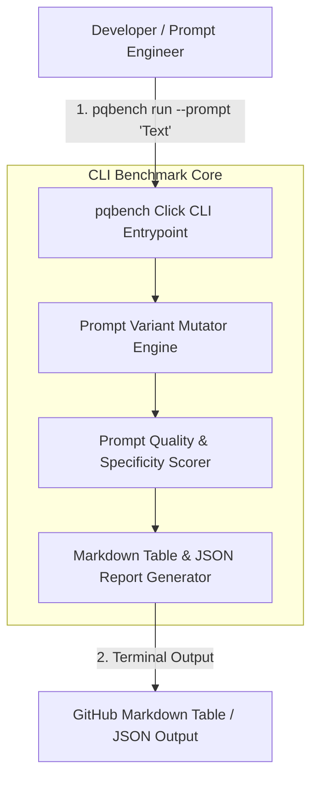

# Prompt Quality Bench CLI Architecture

The **`pqbench` CLI Utility** provides prompt engineering benchmark execution, automated prompt mutation generation (Chain-of-Thought, System Persona, Format Constraints), and terminal/JSON quality scoring reports.

## CLI Pipeline Diagram

## Module Breakdown

1. **CLI Interface (`pqbench/cli/main.py`)**
   - Click command line interface accepting `--prompt` and `--format` arguments.

2. **Prompt Mutator (`pqbench/mutators/prompt_mutator.py`)**
   - Generates systematic prompt variants (`baseline`, `chain_of_thought`, `role_persona`, `json_format_guard`).

3. **Quality Scorer (`pqbench/metrics/quality_scorer.py`)**
   - Evaluates prompt specificity, token efficiency, structural clarity index, and overall quality grades (`A+`, `B`).

4. **Report Generator (`pqbench/reporting/report_generator.py`)**
   - Renders tabulate GitHub-style markdown tables and formatted JSON benchmarking reports.
